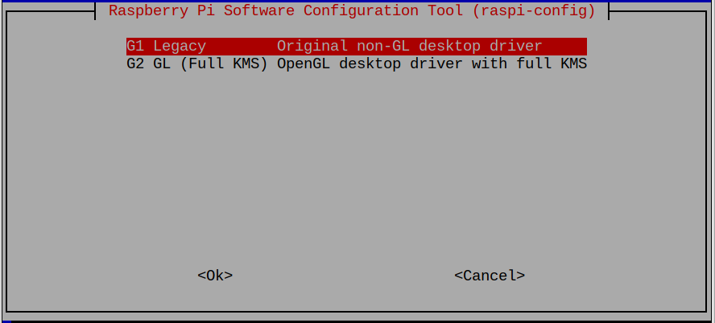

# Raspberry Pi 3 Config

## Configuration tools

```bash
sudo raspi-config
```

See: [Raspberry Pi Documentation](https://www.raspberrypi.com/documentation/computers/configuration.html#raspi-config)


### Boot option

Select the `Desktop Autologin` option


**Note** The default user is `pi` and password is `raspberry`.
We may want to change the password.

See: [Raspberry Pi Documentation Linux](https://www.raspberrypi.com/documentation/computers/using_linux.html)

### Display Options

Disable Screen blanking (Alway keep the screen on)


### Interface options

Select the required interface needed for the specific pi.
All should turn on the `SSH` and `VNC` interfaces which might be required for trouble shooting.


### Advanced Options

The PI 3 required the `Glamor` option for hardware acceleration.


Also on the same menu, change the `GL Driver`



## Other Configuration

### config.txt

The raspberry PI does not drive video output if the TV (HDMI device) is not on during power up.  This can be forced by adding the following lines to the `/boot/config.txt` file.

```text
hdmi_force_hotplug=1
hdmi_group=1
hdmi_mode=16
```

**Note:** The key are already in the config.txt file.
They just need to be uncommented and the correct value added.

See: [Documentation config.txt: HDMI Mode](https://www.raspberrypi.com/documentation/computers/config_txt.html#hdmi-mode)

## Desktop Setup

Set the background to black.

Right click on desktop and select `Desktop Preferences`


Change the `Wallpaper mode` to `Fill with background color only` and set `Background color` to black.

